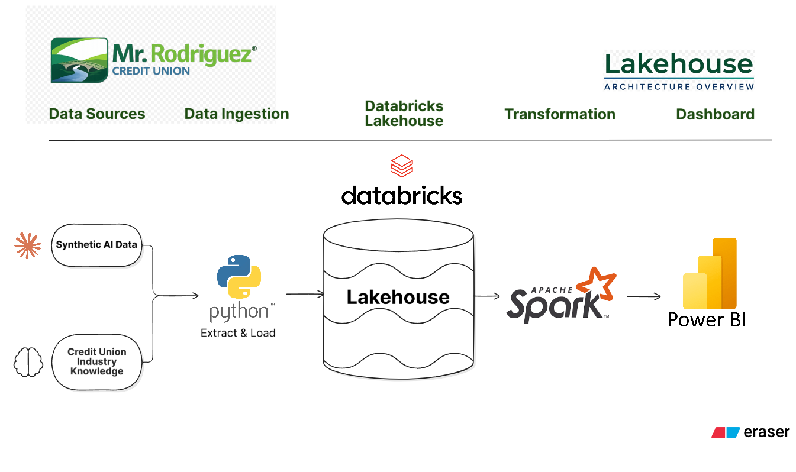
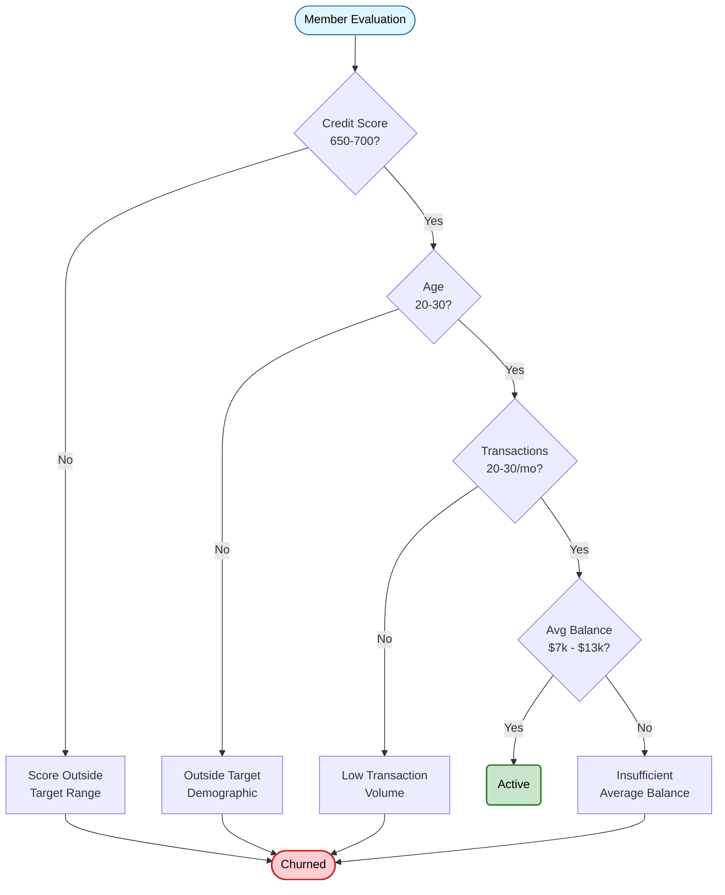

# Credit Union Member Churn Analysis
### Exploratory Data Analysis & Churn Dashboard | Databricks + SQL + Python

---

## Project Overview
### 3 Main Objectives for this Project:
- Show Data Engineering Skills (Medallion Archecture, Python Raw Data Ingestion, Git Version Control)
- Create the project entirely using Databricks 
- Show Analytical Skills (Data Cleaning, Exploration, Business Thinking, Dashboard)

I took 10,000 credit union members (Synthetic Data Generated by AI), analyzed how their personas affected their rate of churn, and built a scalable pipeline in Databricks - the same platform the organization will likely transition to. This is a fun approach to a project that will allow me to showcase my SQL/Python skills for both engineering and analysis.

---

## Business Context
Imagine a system which can predict the rate in which a customer will stop using your product or service based on behavioral analysis - well that's what I built for banking. What does churn mean for a credit union? It is the rate in which our members will stop banking with us. This prediction is valuable because it helps us target members who are more likely to churn, to help maintain or strengthen primacy - all while ensuring that our more loyal members are more than satisfied.

---

## Dataset
| Detail | Value |
|--------|-------|
| Total Members | 10,000 |
| Total Transactions | 7.2M |
| Database Size | ~150MB |
| Source | Synthetic — modeled on real credit union member behavior patterns |

### Member Personas
This project uses 7 distinct member personas based on real-world credit union member behavior patterns.

**Embedded Characteristics:**
- Balances
- Transaction Counts
- Product Counts
- Product Type
- Account Usage

**Time Series Data:**
- Length of time between transactions
- Length of time between product usage

**Persona Types:**
| Persona | Description | Churn Risk |
|---------|-------------|------------|
| Primary Banker | Primacy: Direct deposit, high transaction count, multiple products | Low |
| Rate Shopper | Large balance in CD, minimal transactions — churns at CD maturity | Medium |
| Loan-Only | Personal loan only, goes dormant post-payoff | High |
| Slow Adopter | Takes 6 months to start banking, eventually becomes engaged | Medium |
| Emergency User | Uses PALs frequently, volatile balance, needs Cross Sell intervention | Medium |
| Seasonal Worker | Inconsistent income/activity, moderate churn | Medium |
| Digital-First | Heavy mobile/online usage, minimal branch visits, tech-savvy | Low |

---

## Tech Stack
- **Database:** SQLite (local) → Databricks (cloud)
- **Language:** Python, SQL (Spark SQL)
- **Platform:** Databricks (Delta Lake)
- **Architecture:** Medallion (Bronze → Silver → Gold)
- **Version Control:** GitHub

---

## Lakehouse Architecture (ELT)


## Project Structure
```
├── 01_data_generation/       # Scripts to generate synthetic dataset
├── 02_exploratory_analysis/  # SQLite, pandas, Jupyter. The "before" story.
├── 03_databricks_notebook/   # Spark SQL, Delta Tables, Medallion. The "after" story.
├── data/                     # Preview of member data
├── images/                   # Dashboard and Diagram Images
└── README.md
```

## Dashboard & Insights


### Insights

- **Loan-Only members** take the cake! They had the highest churn rate at **43.8%** with 57 average transactions per member. We may be able to tailor coaching initiatives so employees have deeper conversations on where members have primacy or why they only have loans with us. Looking at our Churned Member Count below, there is a huge gap and potential PSO's. Great insight to pass to branches.
    | Total Member Count | Active Member Count | Churned Member Count |
    |1,500|843|657|
  
- **Primary Bankers** predictably, had the lowest churn at **3.35%** with 648 average transactions per member. These members seemingly require the least maintenance, just continued reassurance that we have their back for banking needs. 
    | Total Member Count | Active Member Count | Churned Member Count |
    |2,000|1,933|67|
  
- **Active members** maintained ~$2,000 higher average balance than churned members. This may be a useful statistic for the data science team for exploration. Lets say we wanted to create a decision tree for predictions to see whether an individual member is likely to churn based on decisions or characteristics. So, if we understand the ranges that churned members usually fall between like average monthly balances, average credit scores, average monthly transactions, then we can create a decision tree to trickle down and eventually lead to a “Active” or “Churned”, allowing us to calculate the probability of churning for individual members. That would look like this:
  


- **Average Age & Credit Score:** I wanted to understand if there was a correlation between low credit or age and churn rate. As you can see, the synthetic data was TOO clean, and those figures came out very similar. In real-world data, these figures would likely differ drastically. Emergency-users for example, may have lower credit scores becasue of more hard inquiries during an emergency (Likely need lending) - possibly leading to an increased churn rate due to being denied for low credit. These members are more likley to be Personal Assistance Loan users. 

---

## Analysis Walkthrough

### Phase 1 — Create Medallion Archetecture in Databricks
- Uploaded .db data into Databricks as a volume 
- Used volume’s file path to ingest data / create sqlite tables in my "workspace" catalog
- Created Schema’s (Bronze, Silver, Gold)

### Phase 2 — Data Ingestion & Familiarization
- Bronze Layer: Ingested Raw Data 
- Silver Layer: Cleaned Raw Data (Check for Nulls, Duplicates, Date Sanity)

### Phase 3 — Member Churn Analysis
- Gold Layer: Aggregation & BI ready data
  
...


## Databricks Highlights
Databricks offered the ability to transition this project to a scalable cloud based platform that allowed for seamless BI Tool (PowerBI) integration.

| Layer | Catalog.Schema | Purpose |
|-------|--------|---------|
| 🟤 Bronze | `workspace.bronze` | Raw ingested data — untouched |
| ⚪ Silver | `workspace.silver` | Cleaned, deduplicated, typed |
| 🟡 Gold | `workspace.gold` | BI-ready aggregations and insights |

- **Delta Tables** — ACID transactions ensure data integrity for sensitive financial data
- **Time Travel** — Ability to audit and query member data at any point in history
- **Spark SQL** — Scalable queries across millions of transactions
- **Catalog Structure** — Organized data governance across schemas

---

## Author
**Ruben Jesus Rodriguez**
*Aspiring Business Analyst | Credit Union Domain | Databricks*

[GitHub](https://github.com/rubenjesus02002) | [LinkedIn](https://www.linkedin.com/in/ruben-jrodriguez)

---
*This project was built as part of interview preparation for a Business Analyst role focused on a Databricks migration in a credit union environment.*
